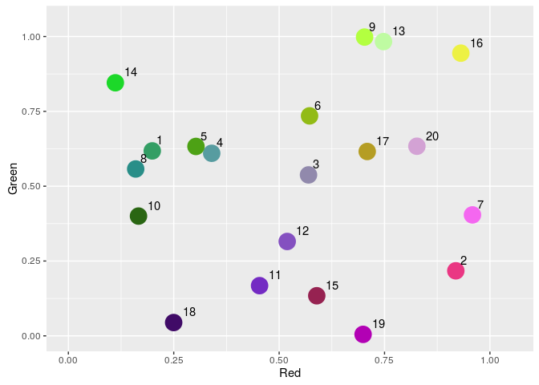
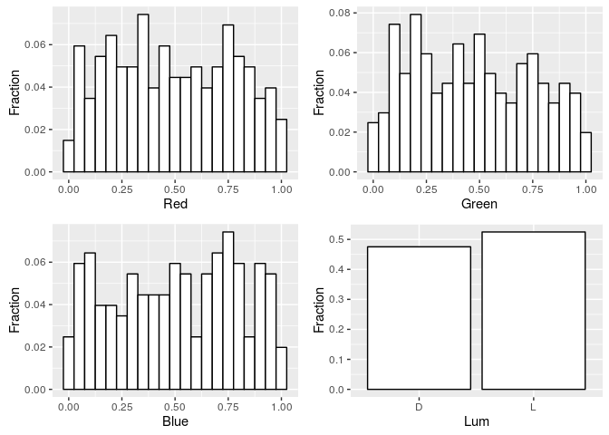
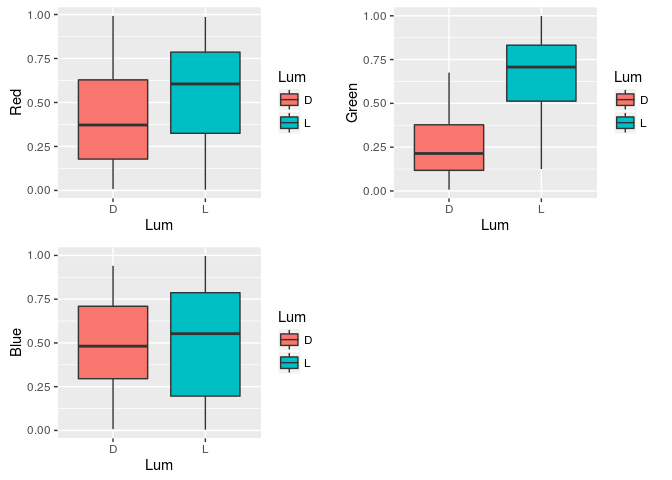
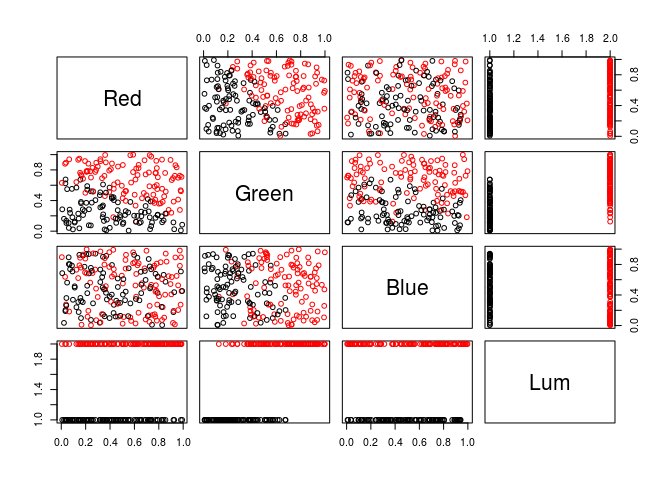
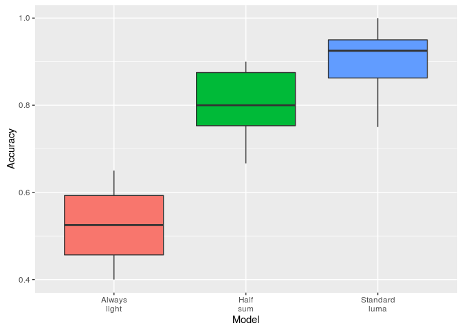
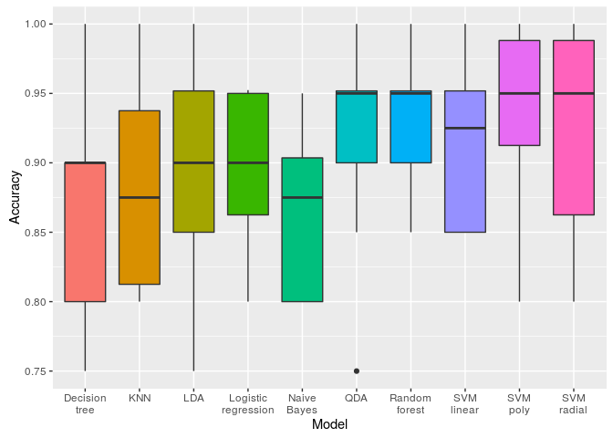
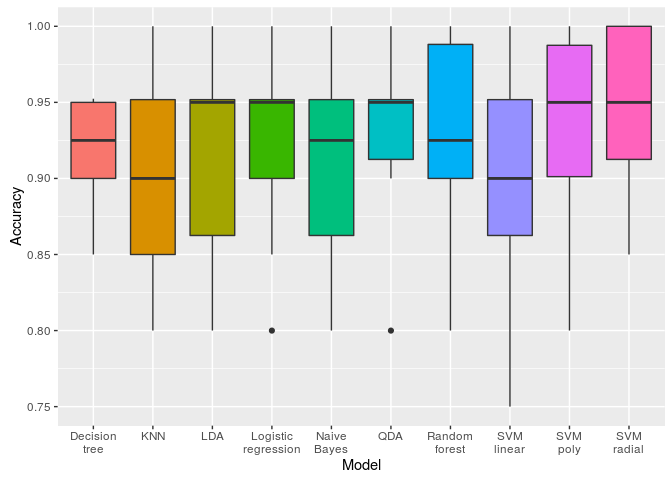
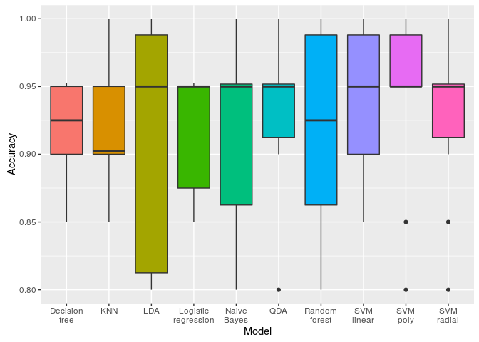
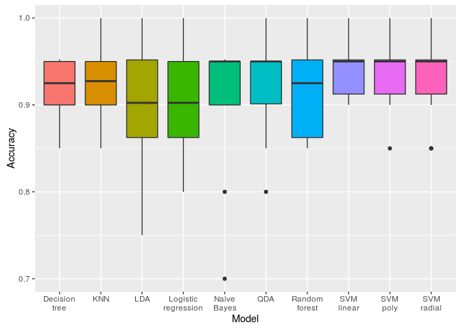
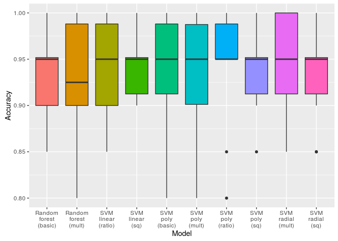

Color Luminance Analysis
================
Dominika Tkaczyk
October 24, 2016

Introduction
============

In this document we analyze colors with respect to whether they are dark or light. From now on, we will call this feature luminance (<https://en.wikipedia.org/wiki/Luma_%28video%29>). The analysis deals with the following main problem: how can we automatically determine whether the color is dark or light?

The issue is not trivial for a couple of reasons:

-   a color is not a single number, for which we could use a single threshold, but rather a combination of a few components (for example red, green and blue light in case of RGB model), each of which may affect the luminance differently,
-   color's luminance is subjective and may differ depending on who is judging it,
-   even though there are colors for which the correct answer is obvious (eg. white or black), there are also a lot of colors in case of which the answer might be ambiguous (eg. pure green).

Problem Statement
-----------------

We will represent colors using RGB model. In this model a color \(c\) is represented by a vector of three numbers \(c = [c_R, c_G, c_B]\), where the red, green and blue intensities are normalized, that is \(0 \leq c_R, c_G, c_B \leq 1\). In this model, white is represented by a vector \(white = [1, 1, 1]\), black by \(black = [0, 0, 0]\), blue will be \(blue = [0, 0, 1]\), and so on.

Color's luminance will be represented by a single categorical variable with two levels: *dark* and *light*.

The problem analyzed in this document is the following: find a function \(L: [0,1]^3 \rightarrow \{d,l\}\), which for a given color determines its luminance.

Data
====

A dedicated dataset was prepared manualy for the purpose of this analysis. First, 300 colors were generated by randomly sampling from uniform distribution for each RGB components separately. Then the colors were labelled manually as *dark* or *light*. For manual labelling we used scatter plots of green intensity against red intensity with points coloured by the "real" color of the data point and labelled with its number from the data set:



Exploratory Analysis
====================

Before exploring our dataset, let's first divide it into train and test sets. All the analyses, plotting and exploring will be done using only train part. In the end, the test set will be used to give a fair, reliable estimate of the prediction's error.

``` r
data <- read.csv("data.csv")
set.seed(2690)
split <- 0.67
trainIndex <- createDataPartition(data$Lum, p = split, list = FALSE)
train <- data[trainIndex,]
row.names(train) <- NULL
test <- data[-trainIndex,]
row.names(test) <- NULL
```

Our train set contains 202 observation with 4 attributes describing each of them. Let's first see how the first few observation look like:

``` r
head(train, n = 10)
```

    ##          Red     Green       Blue Lum
    ## 1  0.1908772 0.2643566 0.77019594   D
    ## 2  0.3598500 0.9953525 0.47292464   L
    ## 3  0.4264704 0.1829865 0.99107870   L
    ## 4  0.4966223 0.5939583 0.65299197   L
    ## 5  0.5033762 0.4312600 0.02559950   L
    ## 6  0.5233165 0.2118095 0.33238907   D
    ## 7  0.2373066 0.7829079 0.56263702   L
    ## 8  0.7839110 0.8241925 0.06574628   L
    ## 9  0.1950080 0.9158516 0.69571098   L
    ## 10 0.8520693 0.7607886 0.40480641   L

**Red**, **Green** and **Blue** attributes are numeric, while **Lum** is a categorical variable with two levels: *L* and *D*:

``` r
str(train)
```

    ## 'data.frame':    202 obs. of  4 variables:
    ##  $ Red  : num  0.191 0.36 0.426 0.497 0.503 ...
    ##  $ Green: num  0.264 0.995 0.183 0.594 0.431 ...
    ##  $ Blue : num  0.7702 0.4729 0.9911 0.653 0.0256 ...
    ##  $ Lum  : Factor w/ 2 levels "D","L": 1 2 2 2 2 1 2 2 2 2 ...

Let's now plot the histograms of all the variables:



The distributions of red, green and blue components seem fairly uniform (this is to be expected, based on how the data set was generated). The dark and light classes are also well balanced, we have similar number of observations in each class.

Let's also examine the boxplots of each variable divided by the luminance:



It can be clearly seen that color components affect the luminance differently:

-   green seems to keep the most information about the luminance; the means of green components for dark and light colors differ greatly, and the IQRs of the distributions do not overlap,
-   red seem to be less correlated with luminance; the means are still far apart, but the IQRs are closer to each other,
-   blue separated the dark and light colors the worst, the two distributions are pretty similar.

We can also perform statistical tests to confirm these observations more formally. We will use non-parametric Kolmogorov–Smirnov test to compare two samples: red/green/blue values for dark and light colors. The p-value will indicate how probable it is that the samples come from the same distibution.

``` r
ks.test(train[train$Lum=='D',]$Red, train[train$Lum=='L',]$Red)
```

    ## 
    ##  Two-sample Kolmogorov-Smirnov test
    ## 
    ## data:  train[train$Lum == "D", ]$Red and train[train$Lum == "L", ]$Red
    ## D = 0.25904, p-value = 0.002317
    ## alternative hypothesis: two-sided

``` r
ks.test(train[train$Lum=='D',]$Green, train[train$Lum=='L',]$Green)
```

    ## 
    ##  Two-sample Kolmogorov-Smirnov test
    ## 
    ## data:  train[train$Lum == "D", ]$Green and train[train$Lum == "L", ]$Green
    ## D = 0.67649, p-value < 2.2e-16
    ## alternative hypothesis: two-sided

``` r
ks.test(train[train$Lum=='D',]$Blue, train[train$Lum=='L',]$Blue)
```

    ## 
    ##  Two-sample Kolmogorov-Smirnov test
    ## 
    ## data:  train[train$Lum == "D", ]$Blue and train[train$Lum == "L", ]$Blue
    ## D = 0.13227, p-value = 0.3414
    ## alternative hypothesis: two-sided

As observed before, in the case of *Blue* we obtained a large p-value, suggesting that the samples are not that different. *Red* and *Green*, however, resulted in a very small p-values, so in these cases the distributions indeed vary a lot.

Let's also examine the correlations between the variables:

``` r
cor(train[,1:3])
```

    ##               Red       Green        Blue
    ## Red    1.00000000 -0.02225762 -0.07202994
    ## Green -0.02225762  1.00000000 -0.05397041
    ## Blue  -0.07202994 -0.05397041  1.00000000

There seem to be no correlations between *Red*, *Green* and *Blue* componenets in our data set. Again, this is to be expected considering how the data set was built.

Let's also plot variables against each other and color the points with luminance:

``` r
pairs(train, col=train$Lum)
```



The plot of *Red* vs. *Green* shows a fairly clear linear separation between the luminance classes. Similar trend can be observed in the *Green* vs. *Blue* plot, but somewhat weaker: more points of different classes lie close together in the middle area. The plot *Red* vs. *Blue* shows no pattern.

The initial analysis results in the following conclusions:

-   green components seem to be the most informative of the luminance, and blue - the least,
-   linear methods might be a good approach to the prediction problem, as the plots show the possibility of a linear separation between dark and light classes.

Evaluation
==========

We will use the train portion of the dataset to evaluate and compare various models. Since luminance classes are balanced, we will use accuracy as the main evaluation metric. A result for a single model is an array of 10 accuracy values obtained by a 10-fold cross validation on the train set. In the first version we will compare the models using a mean of those values.

Function *evaluate* takes a model function and returns a vector of 10 accuracies obtained during a 10-fold cross validation. A *model function* should take two parameters: a training and a testing set, and after learning the model using the training set it should output the predicted values for the testing set. In this setting, it will be executed 10 times by the *evaluate* function with the arguments equal to 9/10 and the remaining 1/10 of the train set, respectively.

Example execution (this random model function ignores the training set):

``` r
modelRandom <- function(training, testing) {
    set.seed(2690)
    sample(c("D", "L"), nrow(testing), replace = TRUE)
}
cvSummary(evaluate(train, modelRandom))
```

    ## $mean
    ## [1] 0.5042857
    ## 
    ## $sd
    ## [1] 0.06511613

Prediction Models
=================

Baseline Models
---------------

Let's start with a few simple baseline models, which do not require any training at all. We will use the following models:

-   **modelAlwaysLight** predicts *light* for all data points,
-   **modelHalfSum** predicts *light* when average color components intensity is greater than or equal 0.5, that is when \(c_R + c_G + c_B \geq 1.5\)
-   **modelStandardLuma** uses the standard luma definition for digital formats (see <https://en.wikipedia.org/wiki/Luma_%28video%29>)

``` r
modelAlwaysLightResult <- evaluate(train, modelAlwaysLight)
modelHalfSumResult <- evaluate(train, modelHalfSum)
modelStandardLumaResult <- evaluate(train, modelStandardLuma)
```

Let's also compare out baseline models visually by plotting box plots of the distributions of the accuracies obtained by each model during cross validation:

``` r
results <- list(
    "Always light"  = modelAlwaysLightResult,
    "Half sum"      = modelHalfSumResult,
    "Standard luma" = modelStandardLumaResult
)
visualizeResults(results)
```



The following table summarizes baseline models' results. To compare the models more formally, we use statistical tests to find out whether the differences between the results obtained in the cross validation are statistically significant. Wilcoxon signed-rank test is used to compare the results and the models are ordered by the number of statistical wins:

    ##          Method      Mean         SD       Min  Max StatWins
    ## 1 Standard luma 0.9052381 0.07262490 0.7500000 1.00        2
    ## 2      Half sum 0.7978571 0.08278695 0.6666667 0.90        1
    ## 3  Always light 0.5247619 0.08133430 0.4000000 0.65        0

We can clearly see that standard luma equation gives very good results and outperforms other baseline methods.

Learning Models
---------------

Now let's fit a few models to the dataset and see how they perform. We are using *caret* package which by default performs a grid search in order to find the best parameters for a model. We will try the following learning methods:

-   Logistic Regression
-   Linear Discriminant Analysis and Quadratic Discriminant Analysis
-   Naive Bayes
-   Decision Tees and Random Forest
-   Support Vector Machines with linear, polynomial and radial kernel
-   K-Nearest Neighbors

We will also enhance our dataset with new features:

-   the squares of all RGB components: *SqRed*, *SqGreen*, *SqBlue*
-   the square roots of all RGB components: *SqRootRed*, *SqRootGreen*, *SqRootBlue*
-   multiplications of the components: *MultRedGreen*, *MultGreenBlue*, *MultRedBlue*, *MultRedGreenBlue*
-   ratios of the components: *RatioRedGreen*, *RatioGreenRed*, *RatioedBlue*, *RatioBlueRed*, *RatioBlueGreen*, *RatioGreenBlue*, *RatioRedGreenBlue*

Each model starts with a different base sets of the features and performs feature selection within each fold (Recursive Feature Elimination using caret-provided feature importance scores).

### Basic Features

These models use only the three basic features:



    ##                 Method      Mean         SD  Min      Max StatWins
    ## 1             SVM poly 0.9402381 0.06151126 0.80 1.000000        3
    ## 2        Random forest 0.9302381 0.05385200 0.85 1.000000        3
    ## 3           SVM radial 0.9252381 0.07178219 0.80 1.000000        2
    ## 4           SVM linear 0.9152381 0.06273557 0.85 1.000000        2
    ## 5                  QDA 0.9154762 0.07117459 0.75 1.000000        1
    ## 6                  LDA 0.9002381 0.07834624 0.75 1.000000        0
    ## 7  Logistic regression 0.8954762 0.06035348 0.80 0.952381        0
    ## 8                  KNN 0.8802381 0.07175455 0.80 1.000000        0
    ## 9        Decision tree 0.8654762 0.07498425 0.75 1.000000        0
    ## 10         Naive Bayes 0.8609524 0.05754050 0.80 0.950000        0

### Basic Features + Multiplication Features

These models use three basic features and features based on multiplication:



    ##                 Method      Mean         SD  Min      Max StatWins
    ## 1           SVM radial 0.9500000 0.05270463 0.85 1.000000        4
    ## 2             SVM poly 0.9354762 0.06230487 0.80 1.000000        0
    ## 3                  QDA 0.9352381 0.05804838 0.80 1.000000        0
    ## 4  Logistic regression 0.9252381 0.06357336 0.80 1.000000        0
    ## 5        Random forest 0.9252381 0.06780212 0.80 1.000000        0
    ## 6        Decision tree 0.9154762 0.04162318 0.85 0.952381        0
    ## 7                  LDA 0.9152381 0.07484931 0.80 1.000000        0
    ## 8          Naive Bayes 0.9104762 0.06181516 0.80 1.000000        0
    ## 9                  KNN 0.9052381 0.06869367 0.80 1.000000        0
    ## 10          SVM linear 0.9002381 0.08181497 0.75 1.000000        0

### Basic Features + Multiplication Features + Ratio Features

These models use three basic features, features based on multiplication and ratio-based features:



    ##                 Method      Mean         SD  Min      Max StatWins
    ## 1           SVM linear 0.9402381 0.05169647 0.85 1.000000        0
    ## 2             SVM poly 0.9402381 0.06587254 0.80 1.000000        0
    ## 3                  QDA 0.9352381 0.05804838 0.80 1.000000        0
    ## 4           SVM radial 0.9254762 0.05915814 0.80 1.000000        0
    ## 5  Logistic regression 0.9204762 0.04864244 0.85 0.952381        0
    ## 6        Random forest 0.9202381 0.07160692 0.80 1.000000        0
    ## 7                  KNN 0.9157143 0.04748924 0.85 1.000000        0
    ## 8          Naive Bayes 0.9154762 0.06288650 0.80 1.000000        0
    ## 9        Decision tree 0.9154762 0.04162318 0.85 0.952381        0
    ## 10                 LDA 0.9102381 0.08768351 0.80 1.000000        0

### Basic Features + Multiplication Features + Ratio Features + Square Features

These models use three basic features and all additional features:



    ##                 Method      Mean         SD  Min      Max StatWins
    ## 1           SVM linear 0.9452381 0.03693675 0.90 1.000000        0
    ## 2             SVM poly 0.9402381 0.04601053 0.85 1.000000        0
    ## 3           SVM radial 0.9304762 0.04853355 0.85 1.000000        0
    ## 4                  KNN 0.9257143 0.04236638 0.85 1.000000        0
    ## 5                  QDA 0.9207143 0.05866631 0.80 1.000000        0
    ## 6        Decision tree 0.9154762 0.04162318 0.85 0.952381        0
    ## 7        Random forest 0.9154762 0.05332542 0.85 1.000000        0
    ## 8                  LDA 0.9007143 0.08182728 0.75 1.000000        0
    ## 9  Logistic regression 0.9004762 0.06668367 0.80 1.000000        0
    ## 10         Naive Bayes 0.9004762 0.08530029 0.70 0.952381        0

### Model Comparison

Now we will compare all the models built so far, including the baseline models:

    ##                         Method    Mean      SD     Min     Max StatWins
    ## 1            SVM radial (mult) 0.95000 0.05270 0.85000 1.00000       17
    ## 2           SVM linear (ratio) 0.94024 0.05170 0.85000 1.00000       11
    ## 3             SVM poly (ratio) 0.94024 0.06587 0.80000 1.00000       10
    ## 4              SVM linear (sq) 0.94524 0.03694 0.90000 1.00000        8
    ## 5             SVM poly (basic) 0.94024 0.06151 0.80000 1.00000        8
    ## 6              SVM poly (mult) 0.93548 0.06230 0.80000 1.00000        7
    ## 7                SVM poly (sq) 0.94024 0.04601 0.85000 1.00000        6
    ## 8              SVM radial (sq) 0.93048 0.04853 0.85000 1.00000        5
    ## 9        Random forest (basic) 0.93024 0.05385 0.85000 1.00000        5
    ## 10        Random forest (mult) 0.92524 0.06780 0.80000 1.00000        5
    ## 11                  QDA (mult) 0.93524 0.05805 0.80000 1.00000        4
    ## 12                 QDA (ratio) 0.93524 0.05805 0.80000 1.00000        4
    ## 13                    KNN (sq) 0.92571 0.04237 0.85000 1.00000        4
    ## 14          SVM radial (ratio) 0.92548 0.05916 0.80000 1.00000        4
    ## 15          SVM radial (basic) 0.92524 0.07178 0.80000 1.00000        4
    ## 16  Logistic regression (mult) 0.92524 0.06357 0.80000 1.00000        4
    ## 17 Logistic regression (ratio) 0.92048 0.04864 0.85000 0.95238        4
    ## 18       Random forest (ratio) 0.92024 0.07161 0.80000 1.00000        4
    ## 19                 KNN (ratio) 0.91571 0.04749 0.85000 1.00000        4
    ## 20        Decision tree (mult) 0.91548 0.04162 0.85000 0.95238        4
    ## 21         Naive Bayes (ratio) 0.91548 0.06289 0.80000 1.00000        4
    ## 22       Decision tree (ratio) 0.91548 0.04162 0.85000 0.95238        4
    ## 23          Decision tree (sq) 0.91548 0.04162 0.85000 0.95238        4
    ## 24          SVM linear (basic) 0.91524 0.06274 0.85000 1.00000        4
    ## 25                  LDA (mult) 0.91524 0.07485 0.80000 1.00000        4
    ## 26                    QDA (sq) 0.92071 0.05867 0.80000 1.00000        3
    ## 27                 QDA (basic) 0.91548 0.07117 0.75000 1.00000        3
    ## 28          Random forest (sq) 0.91548 0.05333 0.85000 1.00000        3
    ## 29          Naive Bayes (mult) 0.91048 0.06182 0.80000 1.00000        3
    ## 30                 LDA (ratio) 0.91024 0.08768 0.80000 1.00000        3
    ## 31               Standard luma 0.90524 0.07262 0.75000 1.00000        3
    ## 32                  KNN (mult) 0.90524 0.06869 0.80000 1.00000        3
    ## 33                    LDA (sq) 0.90071 0.08183 0.75000 1.00000        2
    ## 34    Logistic regression (sq) 0.90048 0.06668 0.80000 1.00000        2
    ## 35            Naive Bayes (sq) 0.90048 0.08530 0.70000 0.95238        2
    ## 36                 LDA (basic) 0.90024 0.07835 0.75000 1.00000        2
    ## 37           SVM linear (mult) 0.90024 0.08181 0.75000 1.00000        2
    ## 38 Logistic regression (basic) 0.89548 0.06035 0.80000 0.95238        2
    ## 39                 KNN (basic) 0.88024 0.07175 0.80000 1.00000        1
    ## 40       Decision tree (basic) 0.86548 0.07498 0.75000 1.00000        1
    ## 41         Naive Bayes (basic) 0.86095 0.05754 0.80000 0.95000        1
    ## 42                    Half sum 0.79786 0.08279 0.66667 0.90000        1
    ## 43                Always light 0.52476 0.08133 0.40000 0.65000        0

This is a visualizaton of 10 best models:



Conclusions
===========
