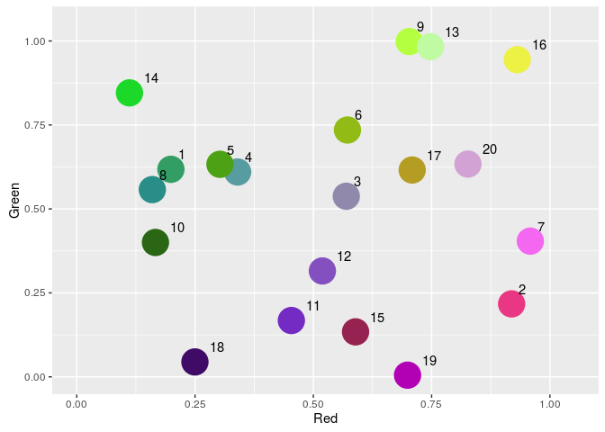

Color Luminance Analysis
================
Dominika Tkaczyk
October 24, 2016

Introduction
============

In this document we attempt to analyze colors with respect to whether they are dark or light. From now on, we will call it color's luminance (<https://en.wikipedia.org/wiki/Luma_%28video%29>). The main problem analyzed is the following: how can we automatically determine whether the color is dark or light.

The issue is not trivial for a couple of reasons:

-   a color is not a single number, for which we could use a single threshold, but rather a combination of a few components (for example red, green and blue light in case of RGB model), each of which may affect the luminance differently
-   color's luminance is subjective and may differ depending on who is judging it
-   even though there are colors for which the correct answer is obivous (eg. white or black), there are also a lot of colors for which it is much less obvious (eg. pure green)

Problem statement
-----------------

We will represent colors using RGB model. A color \(c\) is represented by a vector of three numbers \(c = [c_R, c_G, c_B]\), where the RGB intensities are normalized, that is \(0 \leq c_R, c_G, c_B \leq 1\).

Color's luminance will be represented by a single categorical variable with two levels: *dark* and *light*.

The problem analyzed in this document is the following: find a function \(L: [0,1]^3 \rightarrow \{d,l\}\), which for a given color determines its luminance.

Data
====

A dedicated dataset was prepared for this analysis manually. First, 300 colors were generated by randomly sampling from uniform distribution for each RGB components separately. Then the colors were labelled manually as *dark* or *light*. For manual labelling we used scatter plots of green intensity against red intensity with points coloured by the "real" color of the data point and labelled with its number from the data set:

